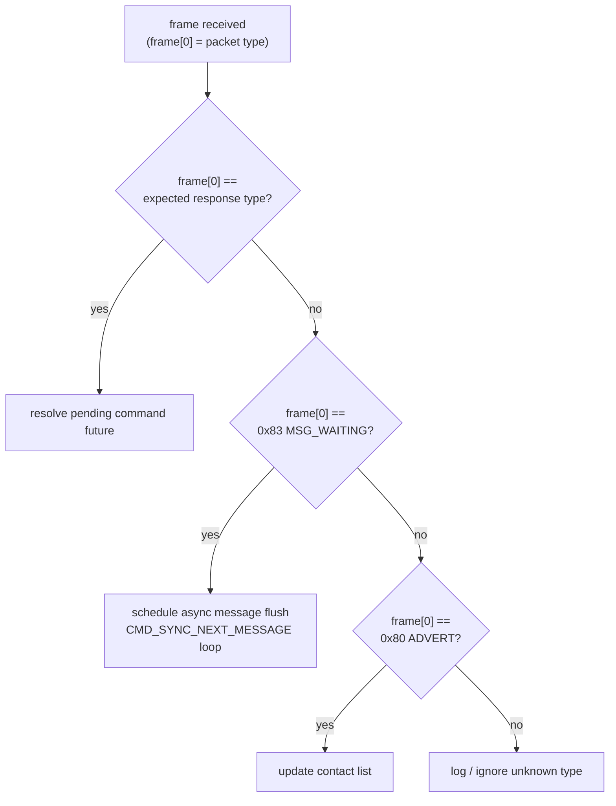
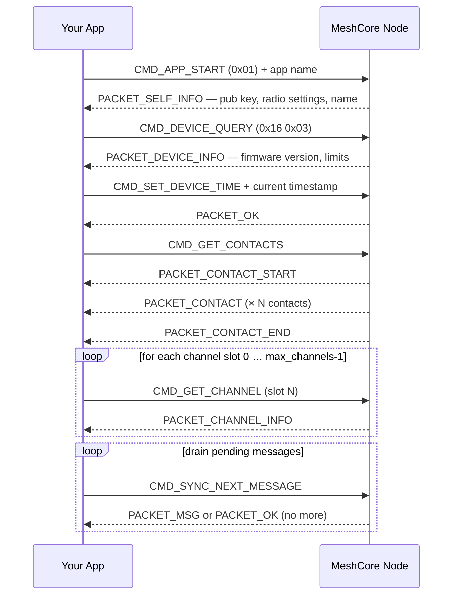

# Command Lifecycle

## The request/response rhythm

The Companion API is **synchronous one-at-a-time**: send one command, wait for the matching response, then send the next. Sending a second command before the first response arrives produces undefined behaviour — the firmware does not tag responses with a request identifier, so your application would have no reliable way to match them.

In pseudocode:

```python
response = await send_and_wait(CMD_GET_CHANNEL, payload=[0x01], expect=PACKET_CHANNEL_INFO, timeout=5.0)
```

The **expected response type** is fixed per command — `CMD_GET_CHANNEL` always yields `PACKET_CHANNEL_INFO`, `CMD_APP_START` always yields `PACKET_SELF_INFO`, and so on. The [Companion Protocol spec](https://docs.meshcore.io/companion_protocol/#response-handling) lists the mapping for every command.

## Push codes — unsolicited notifications

Some frames arrive from the node with no preceding command. These **push codes** carry events that originate on the radio side:

| Push code | Value | Meaning |
|---|---|---|
| `PUSH_CODE_MSG_WAITING` | `0x83` | One or more messages are queued; poll with `CMD_SYNC_NEXT_MESSAGE` |
| `PUSH_CODE_ADVERT` | `0x80` | A contact advertisement was received over the mesh |

Push codes arrive on the same channel as command responses (the TX characteristic or the serial stream). Your receive loop must handle them independently of any in-flight command. A common architecture:



## Startup handshake

After connecting, always perform the full startup sequence before issuing any other commands:

1. **`CMD_APP_START` (`0x01`)** — sends your app's name to the firmware and returns `PACKET_SELF_INFO` (`0x05`) with the node's public key, radio settings, and advertised name. Without this step the firmware does not know a client is present.
2. **`CMD_DEVICE_QUERY` (`0x16 0x03`)** — returns `PACKET_DEVICE_INFO` with firmware version, the firmware's **protocol version code** (`FIRMWARE_VER_CODE`), max contacts, max channel slots, and model string. v1.16 firmware reports version code **13** (v1.15 was 11). Read this code to gate version-dependent features (see [v1.16 command additions](#v116-command-additions)) rather than assuming a capability is present.
3. **`CMD_SET_DEVICE_TIME`** — synchronises the firmware clock. Outbound message timestamps use the firmware clock; a drifted clock means messages arrive with wrong timestamps on the mesh.
4. **`CMD_GET_CONTACTS`** — fetches the full contact list. Returns a `PACKET_CONTACT_START`, one `PACKET_CONTACT` per contact, then `PACKET_CONTACT_END`.
5. **`CMD_GET_CHANNEL` × N** — fetches each channel slot (index 0 through max_channels − 1). Returns `PACKET_CHANNEL_INFO` for each.
6. **`CMD_SYNC_NEXT_MESSAGE` (loop)** — drains any messages that arrived while the client was disconnected.

The startup sequence is not a single command — it is a series of individual request/response pairs, each completing before the next begins.



## v1.16 command additions

These companion commands depend on the firmware's protocol version code (read it
from `PACKET_DEVICE_INFO`; v1.16 reports **13**):

- **`CMD_SEND_RAW_PACKET` (byte `65`)** — payload `[priority][raw packet bytes]`.
  The firmware parses the supplied bytes with `tryParsePacket` and dispatches the
  packet at the given priority. This is distinct from the existing
  `CMD_SEND_RAW_DATA` (byte `25`), which wraps application data in a datagram —
  `CMD_SEND_RAW_PACKET` injects an already-formed packet onto the mesh.
- **Anonymous request to a non-contact node (ver 13+)** — `CMD_SEND_ANON_REQ`
  against a bare public key that is not in the contact list now auto-creates a
  *transient* `ADV_TYPE_NONE` contact from a separate pool (`MAX_ANON_CONTACTS = 8`).
  When that pool is full the firmware returns `ERR_CODE_TABLE_FULL` (3), not
  `ERR_CODE_NOT_FOUND`. Transient entries are not persisted across reboot.
- **Explicit unscoped-flood override (ver 12+)** — `CMD_SET_FLOOD_SCOPE_KEY` with
  sub-byte `1` sets the node to send unscoped floods; sub-byte `0` (optionally
  followed by a 16-byte key) sets or clears the scope override.

Gate each of these on the reported version code: a client talking to older
firmware should fall back rather than send a command the node will reject.

## Timeout and error handling

Use a **5-second timeout** per command as a default. If no matching response arrives within the timeout:

1. Log the timeout (include the command type and payload for debugging).
2. Clear the in-flight command slot in your queue.
3. Proceed to the next queued command.

Do not retry immediately — a timed-out command may still be processing on the firmware side. If repeated commands time out, consider dropping and re-establishing the transport connection.

When the firmware returns `PACKET_ERROR` (`0x01`):

- Byte 1 is an error code (if present). See the [error code table](https://docs.meshcore.io/companion_protocol/#error-codes) for meanings.
- Common codes: `ERR_CODE_NOT_FOUND` (2) when a channel or contact doesn't exist, `ERR_CODE_TABLE_FULL` (3) when the outbound queue is saturated (retry after a short delay), `ERR_CODE_ILLEGAL_ARG` (6) for malformed command payloads.
- After logging, clear the in-flight slot and proceed.

## Command queue in practice

A minimal command queue:

```python
import asyncio

class CommandQueue:
    def __init__(self):
        self._queue = asyncio.Queue()
        self._in_flight = None
        self._pending = asyncio.Future()

    async def send(self, command_bytes, expect_type, timeout=5.0):
        """Enqueue a command and await its response."""
        future = asyncio.get_event_loop().create_future()
        await self._queue.put((command_bytes, expect_type, future))
        return await asyncio.wait_for(future, timeout=timeout)

    async def run(self, transport):
        """Drain the queue, one command at a time."""
        while True:
            cmd_bytes, expect_type, future = await self._queue.get()
            self._in_flight = (expect_type, future)
            await transport.write(cmd_bytes)

    def on_frame_received(self, frame):
        """Called by your receive loop for every incoming frame."""
        packet_type = frame[0]

        if self._in_flight and packet_type == self._in_flight[0]:
            expect_type, future = self._in_flight
            self._in_flight = None
            if not future.done():
                future.set_result(frame)
        elif packet_type == 0x83:
            # PUSH_CODE_MSG_WAITING
            asyncio.create_task(self.flush_messages())
        # … handle other push codes …
```

The key invariant: `self._in_flight` is `None` whenever the queue is idle, and only one command occupies that slot at a time.
