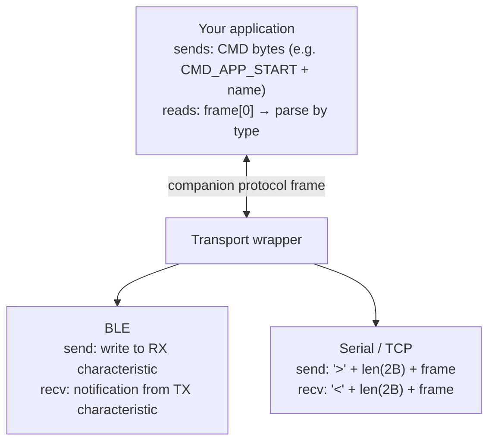

# Frame Model

The Companion API has two framing layers: an outer **transport wrapper** that varies by connection type, and an inner **companion protocol frame** that is the same regardless of transport.

## Companion protocol frame

Every companion protocol frame — command or response — starts with a **one-byte packet type**. The remaining bytes are payload specific to that packet type. There is no fixed header beyond that first byte, and frames are variable length.

```
[ Packet Type (1 byte) ] [ Payload (variable) ]
```

All multi-byte integers in the payload are **little-endian** unless explicitly stated otherwise (CayenneLPP telemetry structures use big-endian — see the telemetry docs).

Commands (app → node) and responses (node → app) share the same single-byte type namespace. A command code like `CMD_APP_START` (`0x01`) and a response code like `PACKET_SELF_INFO` (`0x05`) are distinct values in the same namespace; you always know which direction a frame is travelling based on which side sent it.

The full packet type table — including all command bytes and all response codes — is in the [Companion Protocol spec](https://docs.meshcore.io/companion_protocol/) on docs.meshcore.io. Byte values are authoritative; symbolic names like `PACKET_OK` / `RESP_CODE_OK` / `PUSH_CODE_MSG_WAITING` are source-level aliases.

The maximum companion protocol frame size is **176 bytes** (`MAX_FRAME_SIZE`). Commands that exceed this limit are rejected.

## BLE transport framing

Over BLE, the transport is the NUS-compatible GATT characteristic pair. Each BLE characteristic write or notification carries **exactly one companion protocol frame**. The OS's GATT layer handles fragmentation when a frame is larger than the negotiated MTU; you do not need to implement reassembly yourself on platforms with a proper BLE stack.

From your application's perspective:

- **To send a command:** write the raw companion protocol frame (starting with the command byte) to the RX characteristic.
- **To receive a response or notification:** each notification callback delivers one complete companion protocol frame. Read the first byte to determine the type and then parse accordingly.

Because one BLE write equals one frame, your code can call one notification handler per frame without managing a reassembly buffer across notifications. Future firmware or OS changes may differ, so always validate frame length before parsing variable-length fields.

## Serial transport framing

Over USB serial and TCP, companion protocol frames are wrapped with a simple length-prefix envelope.

**Host → Node (sending a command):**

```
Byte 0:   '>' (0x3E)  — start-of-frame marker
Byte 1:   length LSB  — low byte of payload length (little-endian)
Byte 2:   length MSB  — high byte of payload length
Bytes 3…: companion protocol frame (the command, starting with its type byte)
```

**Node → Host (receiving a response or push):**

```
Byte 0:   '<' (0x3C)  — start-of-frame marker
Byte 1:   length LSB
Byte 2:   length MSB
Bytes 3…: companion protocol frame (the response, starting with its type byte)
```

The length field is the count of payload bytes only — it does not include the three-byte header (`<`/`>` + 2-byte length).

Your receive loop should:

1. Scan for the `<` byte (ignoring any preceding junk).
2. Read the next two bytes as a little-endian uint16 frame length.
3. Buffer exactly that many bytes.
4. Pass the buffer to your frame parser, which reads `buffer[0]` as the packet type.

The firmware re-enters idle scanning after each complete frame, so a dropped or malformed frame does not permanently desync the stream — the next valid `<` byte resumes reception.

## Putting it together

The mental model is:



If you are using an SDK library (`meshcore_py`, `meshcore.js`), framing is handled for you and you only ever see parsed event objects. The framing details here matter if you are implementing a new client from scratch or debugging at the byte level.
