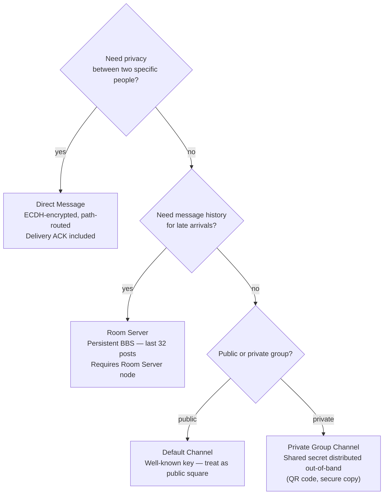

# Channels vs. Direct Messages

MeshCore supports two messaging models: **direct messages** (point-to-point,
encrypted to a specific contact) and **group channels** (broadcast to all
members who share a secret). A third option — **Room Servers** — extends the
channel model with message persistence. Choosing the right model for a use case
is one of the first decisions a new operator makes.

---

## Direct messages

A direct message goes from one node to exactly one other. The recipient is
identified by their public key (or rather, the hash prefix of it that fits in
the packet path). The payload is encrypted with an **ECDH shared secret**
derived from the sender's private key and the recipient's public key — a key
that no third party can derive without one of the two private keys.

**Characteristics:**

- **Point-to-point.** Only the intended recipient can decrypt the payload.
- **Path-routed after first send.** The first delivery floods; subsequent
  messages follow the returned direct path, reducing airtime.
- **Delivery acknowledgement.** The recipient's node sends an ACK; the sender
  knows whether the message arrived.
- **Best for:** private conversations between two known contacts.

### Sending your first direct message

Before you can send a direct message, your contact must appear in your contact
list (received via an advert). Once they do:

1. Select the contact.
2. Compose and send. The first message floods; future messages route directly.

---

## Group channels

A group channel is a **shared secret** known to all members. There is no
list of members maintained anywhere; if you know the secret, you are in the
channel. Anyone who knows the secret can decrypt — and encrypt — channel
messages.

**Characteristics:**

- **Broadcast.** Every node on the mesh that knows the channel secret can read
  the message.
- **Always floods.** Because there is no single known recipient, channel
  messages use flood routing every time — there is no path to discover. Repeaters
  can limit the maximum flood depth with `set flood.max <hops>`.
- **Unverified sender.** Channel messages (`PAYLOAD_TYPE_GRP_TXT`) carry the
  sender's *name* (as they set it), not a signature-verified identity. Any node
  that knows the channel secret can write as any name. Use channels for group
  awareness, not authenticated command-and-control.
- **No delivery ACK.** Flood routing has no acknowledgement mechanism.
- **Best for:** group situational awareness, open community chat, team
  coordination.

### The default public channel

MeshCore ships with a well-known default public channel key:

```
Hex:    8b3387e9c5cdea6ac9e5edbaa115cd72
Base64: izOH6cXN6mrJ5e26oRXNcg==  (used on T-Deck)
```

Any device configured with this key can participate in the default community
channel. Treat it as a public square — assume no privacy.

### Creating a private channel

Share a secret key out-of-band (QR code, secure message, in-person) with the
members of your group. Nodes configured with the same secret form a private
channel that outsiders cannot read, even though the encrypted packet is
broadcast publicly over the air.

!!! info "Channel QR format"
    `meshcore://channel/add?name=<name>&secret=<secret>`

    See [QR Codes and Links](../reference/qr-and-links.md) for details.

---

## Room Servers: channels with memory

A Room Server is a **persistent BBS** layered on top of the channel concept.
Where a group channel delivers messages only to nodes that are online at the
moment of transmission, a Room Server stores posts and replays them to clients
who connect later.

**When a client logs in to a Room Server:**

1. The client authenticates with the guest password.
2. The Room Server delivers the last **32 unread posts** in order.
3. New posts arrive in real time while the client is connected.

**Key differences from group channels:**

| | Group channel | Room Server |
|---|---|---|
| Message persistence | None — missed = gone | Yes — last 32 stored |
| Authentication | Shared secret (passive) | Guest password (active login) |
| Sender identity | Name only (unverified) | Name only (unverified) |
| Delivery model | Flood, no ACK | Push on login |
| Infrastructure | None needed | Requires a Room Server node |

Room Servers are ideal for **teams that are intermittently connected** —
hikers moving in and out of range, incident command posts, or any scenario
where you need to catch up on what was said while you were offline.

---

## Decision guide



---

## What's next

- [How Messages Travel](how-messages-travel.md) — why channel messages always
  flood and how direct messages discover paths.
- [Identity and Encryption](identity-and-encryption.md) — the cryptographic
  details behind direct-message and channel encryption.
- [Running a Room Server](../operating/running-a-room-server.md) — hardware,
  setup, and admin password management.
