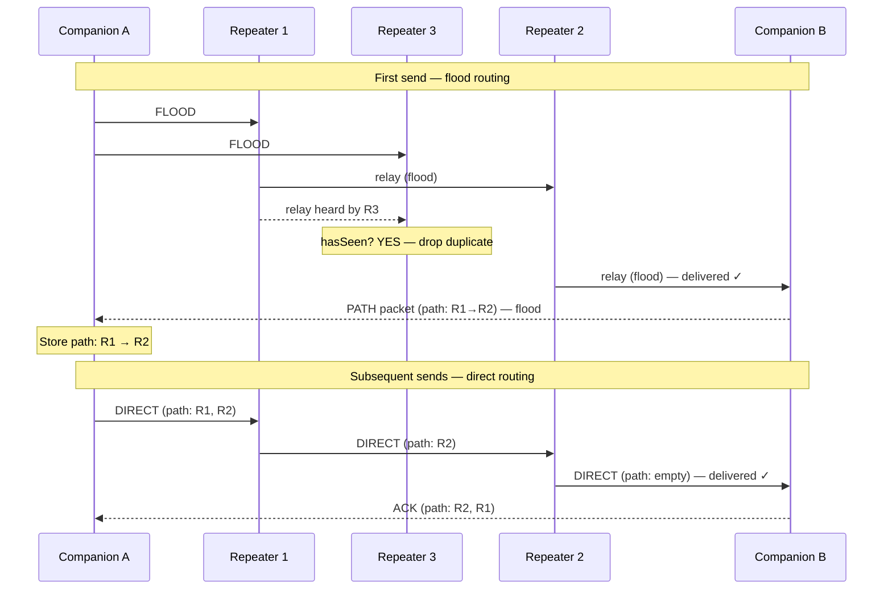

# How Messages Travel

MeshCore uses two distinct routing strategies — **flood routing** and **direct
routing** — and switches between them automatically. Understanding when each is
used explains why your message reaches a node three repeaters away, and why the
channel stays quiet most of the time.

---

## Two routing modes at a glance

| Mode   | How it works | When used |
|--------|-------------|-----------|
| **Flood** | Every repeater that receives the packet rebroadcasts it | First message to a new contact; group channel messages; adverts |
| **Direct** | Packet carries an explicit list of repeater hashes; only the listed repeaters forward it | Subsequent direct messages after a path has been returned |

---

## Flood routing: the first send

When you send a message to a contact for the first time (or send a channel
message), the firmware has no recorded path. It sends the packet as a **flood**:

1. Your companion transmits the packet over LoRa.
2. Every repeater in range that has not seen this packet before rebroadcasts it
   after a short randomised delay (to reduce simultaneous collisions).
3. Each rebroadcast is heard by further repeaters, who repeat the process.
4. The packet propagates outward, hop by hop, until it reaches the destination
   — or until it hits the **hop limit**.

!!! note "Hop limit"
    The firmware enforces a maximum of 64 hops. Each repeater in the path
    consumes one hop slot. In practice, mesh coverage rarely exceeds 10–15
    hops before signal attenuation makes further relaying impractical.

### Duplicate suppression

Flood routing would loop forever if there were no guard against rebroadcasting
a packet you have already forwarded. MeshCore maintains a **seen-packet table**
(`MeshTables::hasSeen()`). A repeater records the hash of each packet it
forwards; if it receives the same packet again (from a different upstream
repeater), it drops the duplicate silently.

---

## Path discovery: the returned path

When the destination node receives your flood message, it does something
important: it sends back a **PATH packet** (`PAYLOAD_TYPE_PATH`) addressed to
you. This PATH packet is itself flood-routed (so it can find the return
route), but it encodes the **list of repeater hashes that the original message
traversed** — the path from you to your contact.

Your companion receives this PATH packet and stores the path in the contact
record. Future sends to the same contact will use **direct routing** instead of
flooding.

---

## Direct routing: subsequent sends

With a path in hand, the firmware embeds the repeater hash list directly into
the packet header (`ROUTE_TYPE_DIRECT`). Each repeater checks whether its own
hash appears next in the path; if it does, it forwards; otherwise, it
ignores the packet. No repeater outside the path re-transmits anything.

**Benefits of direct routing:**

- Uses far less airtime than flooding — only 2–4 radios transmit instead of
  every repeater on the mesh.
- Reduces channel congestion.
- Makes delivered messages harder to intercept (they travel a narrow path).

---

## Path expiry and fallback

LoRa mesh networks are not static. Repeaters go offline, move, or are
reconfigured. When a direct-routed message fails to deliver:

1. The companion retries the direct path up to 3 times.
2. On the final retry, it **clears the stored path** and falls back to a flood
   send.
3. If delivery succeeds via flood, the returned PATH updates the stored route.

This automatic fallback means moving repeaters and temporary outages recover
gracefully without operator intervention.

!!! tip "Manual path override"
    If you know a specific repeater to use, you can set the path manually in
    the companion app. Useful when automatic discovery is taking too long or
    a specific repeater is preferred.

---

## Channel messages always flood

Group channel messages have no single destination node — they are addressed to
every node that knows the channel secret. There is no path to return; every
channel message floods every time.

Repeater operators can limit channel flooding with `set flood.max <hops>` to
prevent channel traffic from consuming the entire mesh budget. As of v1.16,
unscoped floods and advert floods have their own separate caps
(`flood.max.unscoped`, default 64, and `flood.max.advert`, default 8).

See [Channels vs. Direct Messages](channels-vs-direct.md) for the full
channel model.

---

## Visualising a three-hop journey

---

## What's next

- [Channels vs. Direct Messages](channels-vs-direct.md) — group channels,
  shared secrets, and Room Servers.
- [Adverts and Contacts](adverts-and-contacts.md) — how path hashes identify
  repeaters in a route.
- [Identity and Encryption](identity-and-encryption.md) — how payloads are
  encrypted end-to-end along the route.
