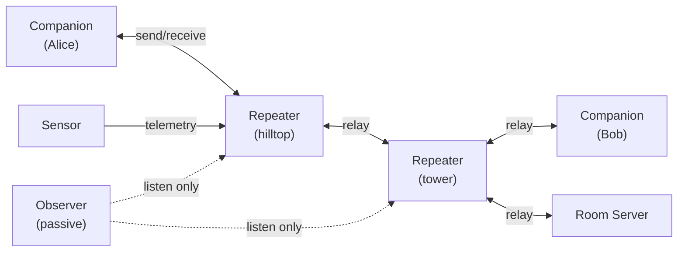

# Nodes and Roles

Every device on a MeshCore network is one of five **node roles**: Companion Radio,
Repeater, Room Server, Sensor, or Observer. The role is baked in at flash time —
it is not a runtime setting. This page explains what each role does, why the
boundary matters, and how to choose the right firmware for a piece of hardware.

---

## Roles at a glance

Companions never relay; only Repeaters forward packets. A Room Server stores
message history. Sensors emit telemetry. An Observer listens but never
transmits — it is a Repeater in passive monitoring mode.

---

## Why roles are fixed

MeshCore is *messaging-first*. Keeping roles fixed lets the protocol make a
simple, reliable promise: **only designated repeaters retransmit packets**.
Companion radios stay silent after a receive. The result is a much quieter
channel compared to systems where every node repeats everything it hears, and
far fewer collisions when multiple nodes are in range.

The trade-off is intentional: a device running Companion firmware cannot
simultaneously act as an infrastructure repeater. If you want coverage, deploy
dedicated repeater hardware.

---

## The five roles

### Companion Radio

The Companion Radio is the *client* firmware. It connects to a user-facing app
(Android, iOS, the web client at [app.meshcore.nz](https://app.meshcore.nz),
or a desktop client) over BLE, USB-Serial, or Wi-Fi. From the user's
perspective, the companion is the radio in their pocket.

Key behaviours:

- **Does not repeat.** When a Companion hears a packet intended for someone
  else, it stays quiet.
- **Sends adverts manually.** The user taps "advertise" to broadcast their
  identity; the companion does not auto-flood on a timer.
- **Maintains a contact list.** Public keys received from adverts populate the
  address book; ECDH shared secrets are derived per-contact for encryption.
- **Discovers paths.** The first message to a new contact floods the network;
  the path returned by the delivery acknowledgement is stored and reused on
  subsequent sends.

!!! tip "Companion variants"
    There are separate firmware builds for BLE, USB-Serial, and Wi-Fi
    connections. Choose the one that matches how your app will talk to the
    device. BLE is the most common for smartphones.

### Repeater

The Repeater extends network coverage by forwarding packets it receives. It is
**pure infrastructure** — it has no user interface for messaging. Repeaters are
typically placed at high elevation (hilltop, tower, rooftop) to maximise
RF line-of-sight.

Key behaviours:

- **Repeats flood packets.** When a flood packet arrives, the repeater
  rebroadcasts it after a short randomised delay to reduce collisions.
- **Forwards direct packets.** When a direct-routed packet lists this repeater's
  hash in its path, the repeater passes it along.
- **Flood-adverts periodically.** By default every 47 hours, a repeater sends a
  flood advert so network participants can discover it and factor it into paths.
  The interval is configurable (`set flood.advert.interval <hours>`).
- **Administrable remotely.** Via the companion app or CLI over USB, operators
  can set frequency, admin password, flood limits, and other parameters.

!!! note "Room Servers can optionally repeat"
    A Room Server can be configured with `set repeat on`, but this is not
    recommended — a dedicated Repeater firmware device handles infrastructure
    duties better and has the full remote-admin feature set.

### Room Server

The Room Server is a **shared bulletin-board server** (BBS). Where channels
deliver messages only to nodes that are online at the moment the message is
sent, a Room Server *stores* posts and replays them to clients who connect
later.

Key behaviours:

- **Stores message history.** When a client logs in, the Room Server delivers
  the last 32 unread posts.
- **Requires login.** Clients must provide a guest password (`hello` by default,
  configurable with `set guest.password`).
- **Administrable remotely.** Same remote-admin interface as a Repeater, secured
  by a separate admin password (`password` by default).
- **Not a replacement for Repeater.** Run them on separate hardware for the best
  experience.

### Sensor

The Sensor role is for **telemetry nodes** — remote devices that collect and
report data (temperature, humidity, location, custom values). Sensors transmit
readings on a schedule and can be configured to trigger alerts. They do not
participate in message routing.

See the `simple_sensor` example in the MeshCore source repository for a
starting point.

### Observer

Observer is a **passive monitoring mode**, not a separate firmware binary. A
Repeater running in observer mode listens to everything it hears and reports
packet statistics to an upstream aggregator (such as the LetsMesh.net analyser).
It does not retransmit packets; its sole job is passive RF observation.

Enable via the observer onboarding instructions at
[analyzer.letsmesh.net/observer/onboard](https://analyzer.letsmesh.net/observer/onboard).

---

## Choosing a role for your hardware

| I want to…                                       | Role to flash   |
|--------------------------------------------------|-----------------|
| Send and receive messages via my phone or PC     | **Companion Radio** |
| Extend coverage from a high point                | **Repeater**    |
| Host a shared message board with history         | **Room Server** |
| Report sensor readings to the mesh               | **Sensor**      |
| Passively monitor the RF channel for analysis    | **Repeater** (observer mode) |

---

## What's next

- [Adverts and Contacts](adverts-and-contacts.md) — how nodes announce
  themselves and how you build your address book.
- [How Messages Travel](how-messages-travel.md) — flooding, path discovery, and
  multi-hop routing.
