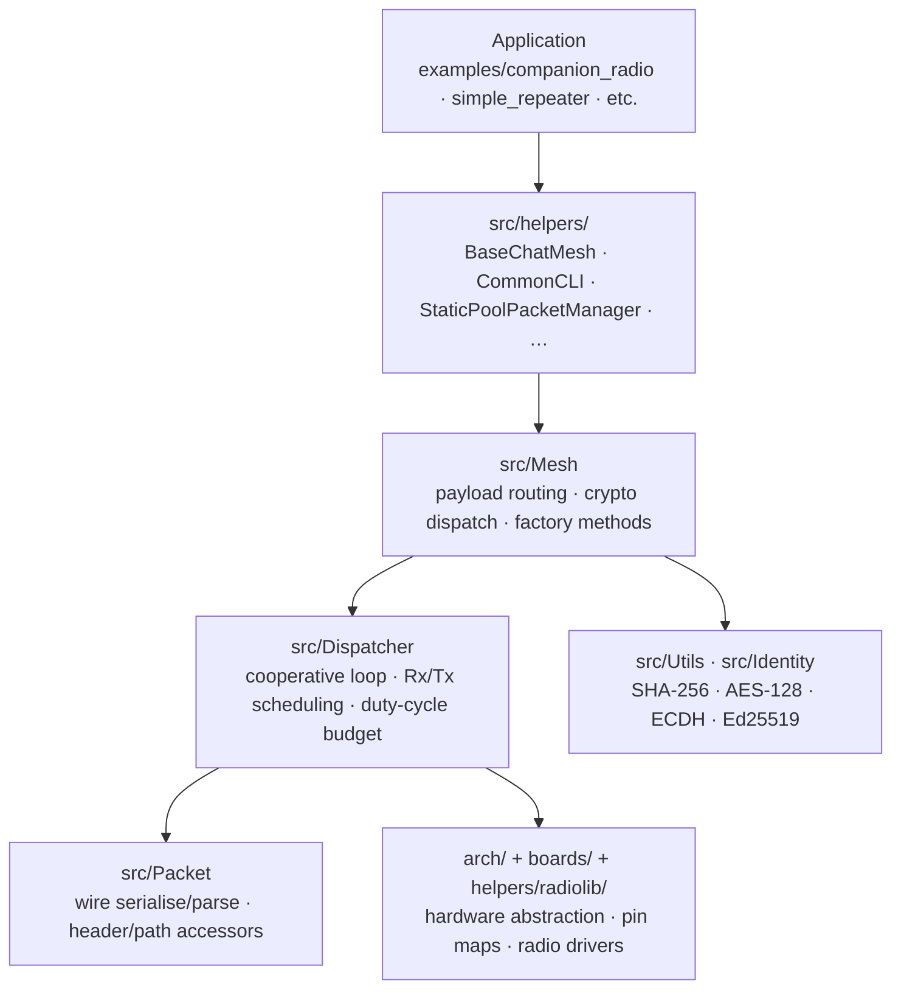

# Codebase Map

A high-level tour of the MeshCore source tree so you can find what you need
without excavating every subdirectory.

## Top-level layout

```
MeshCore/
├── src/                   # Core library — the mesh protocol stack
│   ├── MeshCore.h         # Root types: MainBoard, RTCClock, constants
│   ├── Utils.{h,cpp}      # SHA-256, AES-128, ECDH helpers, hex utils
│   ├── Identity.{h,cpp}   # Identity / LocalIdentity (Ed25519 key pairs)
│   ├── Packet.{h,cpp}     # Packet — the fundamental wire object
│   ├── Dispatcher.{h,cpp} # Radio loop, Rx/Tx scheduling, duty-cycle budget
│   ├── Mesh.{h,cpp}       # Routing logic, protocol dispatch, factory methods
│   └── helpers/           # Optional but almost-always-used helpers
├── examples/              # Six complete application examples
│   ├── companion_radio/   # The Companion radio firmware (BLE/USB/Wi-Fi API host)
│   ├── simple_repeater/   # Repeater node
│   ├── simple_room_server/# BBS/room-server node
│   ├── simple_sensor/     # Telemetry sensor node
│   ├── simple_secure_chat/# Simple peer-to-peer secure chat
│   └── kiss_modem/        # KISS TNC modem integration
├── arch/                  # Platform-specific radio + RTC glue
│   ├── esp32/             # ESP32 radio init, RNG seed, RTC
│   └── stm32/             # STM32 equivalents
├── boards/                # One subdirectory per supported board family
│   ├── heltec_v3/
│   ├── lilygo_t3s3/
│   └── …                  # ~30 boards
├── variants/              # PlatformIO build definitions (one JSON per target)
│   ├── heltec_v3.json
│   └── …                  # ~40 variants
├── platformio.ini         # Root PlatformIO config; imports all variant INIs
├── build.sh               # Shell wrapper: build one or all variants
└── build_as_lib.py        # Builds the core as an Arduino library
```

## Software architecture



## `src/` — the protocol stack

The six files in `src/` are the portable heart of the project.
They have no Arduino dependencies and can be compiled for any target.

| File | Role |
|---|---|
| `MeshCore.h` | Root constants (`MAX_PACKET_PAYLOAD`, `PUB_KEY_SIZE`, …), `MainBoard` interface, `RTCClock` interface |
| `Utils.{h,cpp}` | Stateless crypto utilities: SHA-256, AES-128 encrypt/decrypt, ECDH, hex encode/decode |
| `Identity.{h,cpp}` | `Identity` (verify-only, 32-byte Ed25519 pub key) and `LocalIdentity` (sign + ECDH, adds 64-byte prv key) |
| `Packet.{h,cpp}` | `Packet` struct: `header`, `path[]`, `payload[]`, route/payload-type accessors, wire serialisation |
| `Dispatcher.{h,cpp}` | Abstract base: `Radio` + `PacketManager` + `MillisecondClock` → cooperative Rx/Tx loop |
| `Mesh.{h,cpp}` | Extends `Dispatcher`: understands payload types, routes/forwards/decrypts, fires `on…Recv()` callbacks |

## `src/helpers/` — the optional toolkit

Helpers are Arduino-dependent implementations that examples wire in.
None are required by the core — you can substitute your own.

| Helper | Purpose |
|---|---|
| `SimpleMeshTables.h` | Cyclic ring-buffer of 160 packet hashes — duplicate detection |
| `StaticPoolPacketManager.{h,cpp}` | Fixed-size packet pool + priority outbound queue |
| `ArduinoHelpers.h` | `ArduinoMillis` (wraps `millis()`), `StdRNG` (wraps `random()`) |
| `ArduinoSerialInterface.{h,cpp}` | Framed serial/BLE command interface for companion-radio |
| `BaseSerialInterface.h` | Abstract base for the serial interface |
| `BaseChatMesh.{h,cpp}` | Contact list, message queue, ACK tracking — used by companion_radio |
| `CommonCLI.{h,cpp}` | Admin CLI command parser (used by repeater, room server, sensor) |
| `ClientACL.{h,cpp}` | Authorised-client list for admin commands |
| `IdentityStore.{h,cpp}` | Filesystem-backed identity persistence |
| `AdvertDataHelpers.{h,cpp}` | Build/parse advert payloads |
| `TxtDataHelpers.{h,cpp}` | Build/parse text message payloads |
| `RegionMap.{h,cpp}` | RF region / transport-key scoping |
| `TransportKeyStore.{h,cpp}` | Persistent store for transport keys |
| `SensorManager.h` | Telemetry pipeline for sensor nodes |
| `StatsFormatHelper.h` | Format stats reply strings |
| `ESP32Board.h` / `NRF52Board.{h,cpp}` | Platform-specific `MainBoard` implementations |
| `radiolib/` | RadioLib radio driver wrappers (SX1262, SX1268, SX127x, …) |
| `bridges/` | RS232 and ESPNow bridge implementations |
| `ui/` | Display + button helpers |
| `sensors/` | Individual sensor drivers (GPS, BME280, …) |

## `examples/` — the application layer

Each example is a complete, flashable firmware image.
They all follow the same pattern: instantiate the stack, subclass `Mesh`
(or a higher-level helper), wire the `setup()` / `loop()` callbacks.
See [Example Apps](example-apps.md) for a detailed walkthrough.

## `arch/` — platform radio glue

`arch/esp32/` and `arch/stm32/` provide the `radio_init()` function,
`radio_driver` object, `rtc_clock`, and `radio_new_identity()` helper that
examples call in `setup()`. The right `arch/` subdirectory is selected by
the build system based on the variant's platform flag.

## `boards/` — per-board pin maps

Each board subdirectory (e.g. `boards/heltec_v3/`) contains a `target.h`
that `#define`s pin numbers (`P_LORA_CS`, `P_LORA_DIO_1`, `PIN_VBAT_READ`,
…) and names the board class to instantiate. The build system selects the
right `boards/` folder via `build_src_filter` in the variant's
`platformio.ini`.

## `variants/` — build targets

Each variant JSON file is a PlatformIO board definition (CPU, flash size,
RAM). The root `platformio.ini` uses `extra_configs = variants/*/platformio.ini`
to absorb every variant's per-board environment. Each environment sets
`board`, `board_build.partitions`, `-D` flags, and `build_src_filter` to
pick the right `boards/` and `arch/` directories.

## Build system

| Tool | What it does |
|---|---|
| `platformio.ini` | Master config; pulls in all variant INIs |
| `build.sh` | Builds one or all targets: `./build.sh heltec_v3` or `./build.sh all` |
| `build_as_lib.py` | Packages `src/` as an Arduino library for use outside PlatformIO |
| `create-uf2.py` / `merge-bin.py` | Post-build utilities for UF2 and merged-binary output |

> **Cross-links:**
> For flash instructions and supported device list: [Flash Your First Device](../getting-started/flash-your-first-device.md).
> For build-from-source instructions: [Build From Source](../extending/build-from-source.md).
> For auto-generated class-level codebase reference (call graphs, class hierarchies):
> [DeepWiki — meshcore-dev/MeshCore](https://deepwiki.com/meshcore-dev/MeshCore).
