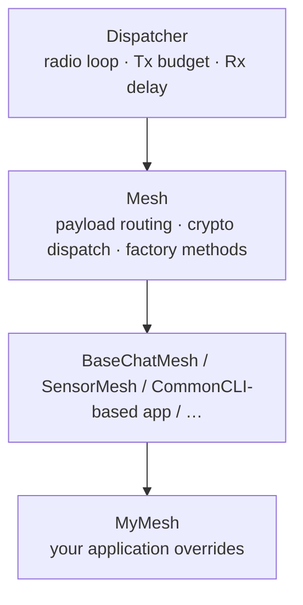
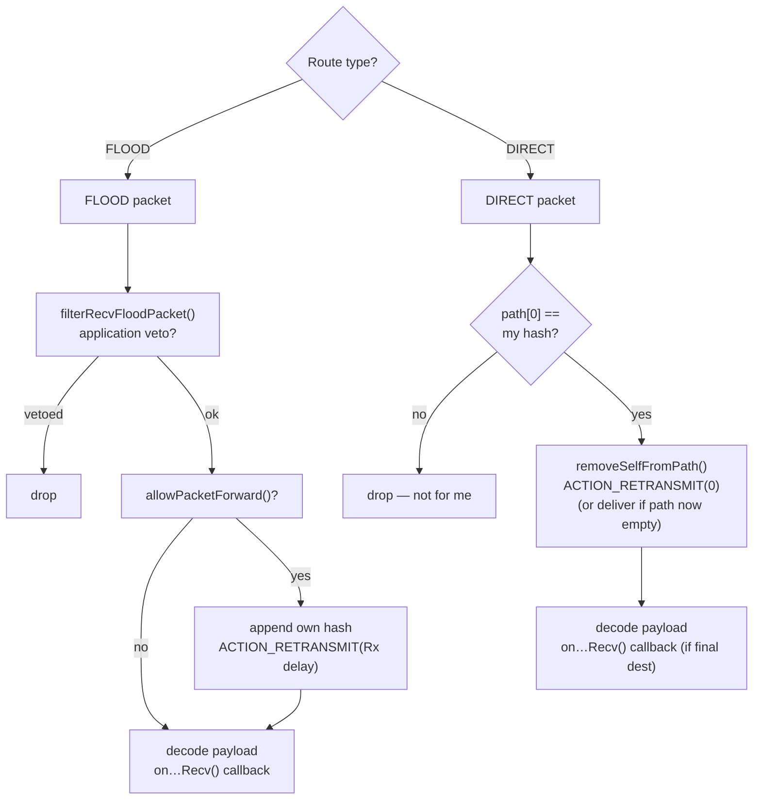

# Mesh & Tables

`Mesh` (`src/Mesh.h`, `src/Mesh.cpp`) is the second layer in the stack,
sitting directly above `Dispatcher`. Where `Dispatcher` knows only raw bytes
and timing, `Mesh` understands payload types, routing decisions, and
cryptography. `MeshTables` provides the duplicate-detection memory.

## `Mesh` inherits from `Dispatcher`



`Mesh` overrides `onRecvPacket()` (the hook `Dispatcher` calls after de-queuing
an inbound packet) and replaces it with `routeRecvPacket()` — a full routing
decision engine.

## The MeshTables interface

```cpp
class MeshTables {
public:
  virtual bool hasSeen(const Packet* packet) = 0;
  virtual void clear(const Packet* packet) = 0;
};
```

`Mesh` calls `hasSeen()` before processing any flood packet. If `true`, the
packet is a duplicate (already seen via another route) and is dropped — the
packet is released back to the pool without calling any `on…Recv()` callback.

`clear()` is called when the application wants to allow a future re-transmission
of a packet it already processed (e.g. after a timed retry path).

### `SimpleMeshTables`

The reference implementation in `src/helpers/SimpleMeshTables.h` uses a
**cyclic ring buffer of 160 entries**, each 8 bytes (the `MAX_HASH_SIZE`
packet hash). The hash is computed over the packet's payload and type byte,
making it unique per message content.

When a new packet arrives, `hasSeen()` walks the table:
- If found → duplicate; increment `_flood_dups` or `_direct_dups` and return `true`.
- If not found → write hash at `_next_idx`, advance index modulo 160, return `false`.

At 160 × 8 = 1280 bytes of RAM this fits even on nRF52840. Because the
table is cyclic, very old hashes are eventually evicted, which is fine —
a packet seen 160+ others ago is too old to re-process.

!!! note "v1.16: ACKs dedup here too"
    Earlier firmware kept a separate 64-entry table of ACK CRCs
    (`MAX_PACKET_ACKS`). v1.16 removed it and grew this table from 128 to 160
    entries. ACK packets now dedup through this same seen-packet table — the
    [random byte appended to each 6-byte extended ACK](../protocol/payload-types-tour.md)
    makes every ACK packet hash unique, so genuine retries are not mistaken for
    duplicates.

## `routeRecvPacket()` — the routing decision

After `hasSeen()` passes, `Mesh` decides what to do with the packet:



The re-transmit delay for flood packets (`getRetransmitDelay()`) and for
direct packets (`getDirectRetransmitDelay()`) are both virtual — overriding
them gives you per-application forwarding timing.

### `allowPacketForward()`

The default implementation checks:
- Does the path already contain this node's hash? If so, it is a loop — drop.
- Is the hop count within the allowed limit?

Application subclasses override this to add more filtering (e.g. `MyMesh`
in the repeater example checks a rate limiter and the interference threshold).

## Payload dispatch

After the routing decision, `Mesh` decodes the `payload_type` from the packet
header and dispatches to the appropriate virtual callback:

| Payload type | Callback |
|---|---|
| `PAYLOAD_TYPE_ADVERT` | `onAdvertRecv()` |
| `PAYLOAD_TYPE_TXT_MSG` / `PAYLOAD_TYPE_REQ` / `PAYLOAD_TYPE_RESPONSE` | Decrypt with peer shared secret → `onPeerDataRecv()` |
| `PAYLOAD_TYPE_ANON_REQ` | Decrypt with ephemeral ECDH → `onAnonDataRecv()` |
| `PAYLOAD_TYPE_PATH` | Decrypt → `onPeerPathRecv()` / `onPathRecv()` |
| `PAYLOAD_TYPE_GRP_TXT` / `PAYLOAD_TYPE_GRP_DATA` | Decrypt with channel secret → `onGroupDataRecv()` |
| `PAYLOAD_TYPE_ACK` | `onAckRecv()` |
| `PAYLOAD_TYPE_TRACE` | `onTraceRecv()` |
| `PAYLOAD_TYPE_CONTROL` | `onControlDataRecv()` |
| `PAYLOAD_TYPE_RAW_CUSTOM` | `onRawDataRecv()` |

All callbacks have default no-op bodies — override only what your application handles.

## Peer lookup: `searchPeersByHash()` and `getPeerSharedSecret()`

Before decrypting a direct datagram, `Mesh` calls `searchPeersByHash(hash)`
to look up the sender in the local contact database. The return value is the
number of matching peers (usually 0 or 1, but could be >1 in hash-collision
edge cases). `Mesh` then calls `getPeerSharedSecret(dest, idx)` for each
match to retrieve the pre-computed ECDH shared secret, which it uses to
decrypt the payload.

Both are virtual, with empty default bodies — your `MyMesh` implements them
against your own contact store (`DataStore`, `ClientACL`, etc.).

## Channel lookup: `searchChannelsByHash()`

For group datagrams, `Mesh` calls `searchChannelsByHash(hash, channels[], max)`
to find all matching `GroupChannel` objects. A `GroupChannel` is a pair of
`hash` (1-byte prefix) and `secret` (32-byte shared group key). The default
implementation always returns 0 (no channels) — override if your node
participates in group channels.

## Packet factory methods

`Mesh` provides factory methods that allocate and fill `Packet` objects for
outbound use. You call these from your application code:

```cpp
Packet* createAdvert(id, app_data, len);
Packet* createDatagram(type, dest, secret, data, len);
Packet* createAnonDatagram(type, sender, dest, secret, data, len);
Packet* createGroupDatagram(type, channel, data, len);
Packet* createAck(ack, len);          // v1.16: byte buffer + length (was a bare 4-byte CRC)
Packet* createPathReturn(dest, secret, path, path_len, extra_type, extra, len);
Packet* createRawData(data, len);
Packet* createTrace(tag, auth_code, flags);
Packet* createControlData(data, len);
```

After creating a packet, dispatch it with one of:

```cpp
void sendFlood(packet, delay_millis, path_hash_size);     // flood routing
void sendDirect(packet, path, path_len, delay_millis);    // direct routing
void sendZeroHop(packet, delay_millis);                   // neighbours only
```

## `self_id` — the node's own identity

`Mesh` holds a public `LocalIdentity self_id` member. This is populated in
`setup()` from the `IdentityStore` (loaded from flash, or generated fresh).
`Mesh` uses it to:
- Append its own hash to flood paths.
- Sign advertisements.
- Perform ECDH key exchange with peers.

## GroupChannel

```cpp
class GroupChannel {
public:
  uint8_t hash[PATH_HASH_SIZE];   // 1-byte channel identifier
  uint8_t secret[PUB_KEY_SIZE];   // 32-byte shared secret
};
```

A `GroupChannel` is a lightweight struct. The hash is derived from the shared
secret so all nodes with the same secret generate the same hash without
coordination.

## Key takeaways

- **`Mesh` is where the mesh *is*.** Routing, deduplication, crypto dispatch,
  and factory methods all live here.
- **All application logic is in virtual overrides.** `Mesh` itself touches no
  application state; it delegates through well-defined callbacks.
- **`MeshTables` is the only stateful routing memory.** There is no routing
  table in the traditional sense — just a seen-packet ring buffer and the
  path embedded in each packet.
- **Peer lookup is application-supplied.** `Mesh` does not know about contacts
  or ACLs; your `MyMesh` wires it to whatever storage you choose.

> **Cross-link:** Packet format details (header byte layout, path encoding,
> payload type byte values) →
> [`docs.meshcore.io/packet_format`](https://docs.meshcore.io/packet_format/)
> and [`docs.meshcore.io/payloads`](https://docs.meshcore.io/payloads/).
