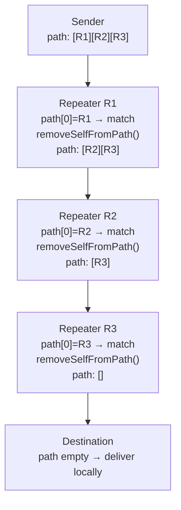

# Packet Anatomy

A MeshCore packet is a compact binary structure. Every field has a job: the
header classifies the packet so that firmware can route it without decrypting
it; the path field drives hop-by-hop delivery; and the payload carries the
actual content. This page explains what each section *means* operationally.

For the exact byte widths and bit positions of every field, see the
[Packet Format](https://docs.meshcore.io/packet_format/) spec on
`docs.meshcore.io`.

---

## The four sections

```
[header (1 B)] [transport_codes (4 B, optional)] [path_length (1 B)] [path (0–64 B)] [payload (0–184 B)]
```

| Section | Size | Role |
|---------|------|------|
| `header` | 1 byte | Classifies the packet: routing mode, payload type, version |
| `transport_codes` | 4 bytes (optional) | Region-scoped codes for inter-region bridging |
| `path_length` | 1 byte | Encodes how many hops the path contains *and* how wide each hash is |
| `path` | `hop_count × hash_size` bytes (max 64) | The ordered list of repeater hashes for routing |
| `payload` | up to 184 bytes | Type-specific content (encrypted or plaintext) |

---

## The header byte

The single header byte packs three sub-fields:

```
Bit: 7  6  5  4  3  2  1  0
     [VER  ][  PAYLOAD TYPE  ][RT]
```

| Bits | Field | Meaning |
|------|-------|---------|
| 0–1  | **Route type** | How should repeaters handle this packet? |
| 2–5  | **Payload type** | What kind of content is in the payload? |
| 6–7  | **Payload version** | Which field-width convention is in use? |

### Route types

| Value | Constant | Meaning |
|-------|----------|---------|
| `0x01` | `ROUTE_TYPE_FLOOD` | Broadcast to all; every eligible repeater relays it |
| `0x02` | `ROUTE_TYPE_DIRECT` | Follow the explicit path in the `path` field |
| `0x00` | `ROUTE_TYPE_TRANSPORT_FLOOD` | Flood with transport codes (inter-region) |
| `0x03` | `ROUTE_TYPE_TRANSPORT_DIRECT` | Direct with transport codes (inter-region) |

Flood and direct routing are the two fundamental modes. Transport-code variants
add a 4-byte region prefix used by transport repeaters that bridge independent
radio regions.

### Payload types

The 4-bit payload type field names what the payload contains. See
[Payload Types Tour](payload-types-tour.md) for a description of each.

### Payload versions

Version `0x00` (`PAYLOAD_VER_1`) is the currently deployed format: 1-byte
source/destination hashes and a 2-byte MAC. Future versions may widen these
fields for stronger collision resistance and authentication, but no firmware
currently uses them.

---

## Transport codes (optional)

When the route type includes transport codes (`ROUTE_TYPE_TRANSPORT_*`), a
4-byte block follows the header before the path:

- `transport_code_1` (2 bytes) — derived from the region's scope; used by
  bridge nodes to decide whether to relay across a region boundary.
- `transport_code_2` (2 bytes) — reserved.

Most nodes on a single-region mesh will never see transport codes. They appear
when a transport repeater is configured to interconnect two separately-tuned
radio channels.

---

## The `path_length` byte

`path_length` is not a raw byte count. It packs two things:

```
Bit: 7  6  5  4  3  2  1  0
     [HASH_SZ-1][   HOP COUNT (0–63)   ]
```

| Bits | Field | Meaning |
|------|-------|---------|
| 0–5  | Hop count | How many hashes are in the `path` field |
| 6–7  | Hash-size code | `hash_size = code + 1` (1, 2, or 3 bytes per hash) |

The actual byte length of the path is `hop_count × hash_size`.

!!! example "Decoding examples"
    - `0x00` — zero hops, no path bytes (fresh flood packet or final-hop direct)
    - `0x05` — 5 hops × 1-byte hashes = 5 path bytes
    - `0x45` — 5 hops × 2-byte hashes = 10 path bytes
    - `0x8A` — 10 hops × 3-byte hashes = 30 path bytes

In code (`src/Packet.h`):

```cpp
uint8_t getPathHashSize()  const { return (path_len >> 6) + 1; }
uint8_t getPathHashCount() const { return path_len & 63; }
uint8_t getPathByteLen()   const { return getPathHashCount() * getPathHashSize(); }
```

---

## The path field

The path is an ordered array of **node hashes** — truncated public-key
prefixes that identify each repeater in the route. Its interpretation depends
on the route type:

### In flood mode

The path starts empty. As the packet propagates, each relaying repeater
**appends its own hash** to the end of the path array:

```
After R1 relays:  [hash(R1)]
After R2 relays:  [hash(R1)][hash(R2)]
After R3 relays:  [hash(R1)][hash(R2)][hash(R3)]
```

When the packet reaches its destination, the path is a full record of every
repeater it touched in order. The recipient can use this path to send a direct
reply.

!!! warning "Path capacity"
    The path field is capped at 64 bytes (`MAX_PATH_SIZE`). With 1-byte hashes
    that allows up to 64 hops; with 2-byte hashes up to 32; with 3-byte hashes
    up to 21. A flood packet that would exceed 64 path bytes is dropped rather
    than truncated.

### In direct mode

The path is set by the sender and contains the pre-planned route. Each
repeater checks whether the **first** hash matches itself, removes it from the
front, and rebroadcasts. The packet shrinks one hash at a time as it traverses
the route.



---

## The payload

The payload carries the actual message content: encrypted text, advert data,
acknowledgments, path records, and so on. Its structure is fully determined
by the payload type in the header.

A few invariants apply regardless of type:

- Maximum 184 bytes (`MAX_PACKET_PAYLOAD`). Packets whose payload exceeds this
  are dropped on receive.
- Encrypted payloads (direct messages, requests, responses) include a 2-byte
  MAC at the front of the encrypted region. Nodes that cannot decrypt the
  content still relay it without inspecting it.
- Advertisement payloads are *signed but not encrypted* — they need to be
  readable by any node that receives them.

---

## From struct to wire

The `Packet` class in `src/Packet.h` is the in-memory representation. When
the firmware transmits, `Packet::writeTo()` serialises it to the wire format;
on receive, `Packet::readFrom()` parses the raw bytes back into the struct.
The firmware never sends a raw `Packet` object — it always goes through this
encode/decode boundary.

---

## What's next

- [Payload Types Tour](payload-types-tour.md) — what each of the 12 payload
  types is for and when it appears.
- [Routing and Flooding](routing-and-flooding.md) — how the path field evolves
  during a flood, and how direct routing uses it.
- [Packet Format spec](https://docs.meshcore.io/packet_format/) — byte-level
  layout with exact bit masks and field widths.
