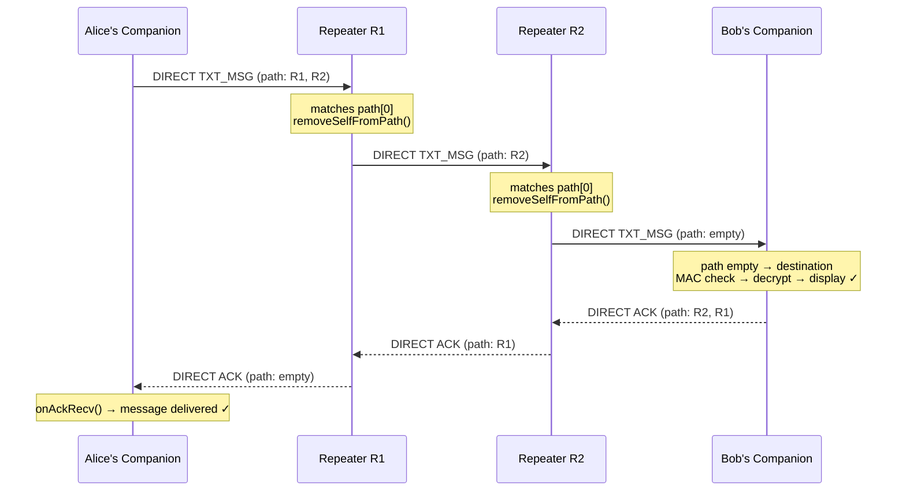

# Packet Journey

This page traces a single direct text message from the moment Alice taps
**Send** in her companion app to the moment it is decrypted and displayed on
Bob's screen. Along the way it names each protocol object involved so that
the deeper pages in this section have concrete hooks to build on.

For the byte-level layout of each field referenced below, see the
[Packet Format](https://docs.meshcore.io/packet_format/) and
[Payloads](https://docs.meshcore.io/payloads/) specs on `docs.meshcore.io`.

---

## The cast

| Actor | Role in this journey |
|-------|---------------------|
| **Alice's companion** | Sends the message; manages the contact list and local identity |
| **Repeater R1** | Hears Alice's transmission; relays it toward Bob |
| **Repeater R2** | Relays the packet one hop further |
| **Bob's companion** | Receives, decrypts, and displays the message |

Alice and Bob have already exchanged adverts and each holds the other's
32-byte Ed25519 public key in their contact list. This is the **second or
later message** they have exchanged, so Alice's firmware already holds a
**returned path** from a previous flood — she knows the route R1 → R2 → Bob.

---

## Step 1 — Composing the packet

Alice's firmware:

1. Looks up Bob's public key from the contact list.
2. Derives the **ECDH shared secret** between Alice's private key and Bob's
   public key (see [Encryption on the Wire](encryption-on-the-wire.md)).
3. Encrypts the plaintext `[timestamp (4 B)][txt_type (1 B)][message text]`
   with AES-128 using a key derived from the shared secret.
4. Prepends a 2-byte **MAC** to the ciphertext.
5. Wraps the encrypted blob with the **wire envelope**:

```
[dest_hash (1 B)][src_hash (1 B)][MAC (2 B)][ciphertext]
```

`dest_hash` and `src_hash` are each the **first byte of the respective
node's public key** — a short identifier used for routing lookups. They are
*not* secret.

6. Fills the `Packet` header byte:
   - Route type: `ROUTE_TYPE_DIRECT` (a stored path exists)
   - Payload type: `PAYLOAD_TYPE_TXT_MSG`
   - Payload version: `PAYLOAD_VER_1` (1-byte hashes, 2-byte MAC)

7. Writes the **path**: a sequence of repeater hashes that spell out the route
   `[hash(R1)][hash(R2)]`. The `path_length` byte encodes both the hash size
   (1 byte each in this example) and the hop count (2).

The finished packet structure on the wire:

```
[header (1 B)][path_length (1 B)][hash(R1)][hash(R2)][dest_hash][src_hash][MAC][ciphertext]
```

---

## Step 2 — Over the air to R1

Alice's radio transmits the packet. R1 sits in range and decodes it.

R1's `Mesh::onRecvPacket()` sees `isRouteDirect()` is true and
`getPathHashCount() > 0`. It checks: **is the first hash in the path my hash?**
(`self_id.isHashMatch(pkt->path, hash_size)`). It matches.

R1:

1. Calls `allowPacketForward()` — it is a repeater, so this returns `true`.
2. Checks `_tables->hasSeen(pkt)` — the `SimpleMeshTables` cyclic buffer of
   recent packet hashes. This is a new packet, so `false`.
3. Calls `removeSelfFromPath()`: decrements the hop count and shifts the
   remaining hashes forward, so the path is now just `[hash(R2)]`.
4. Schedules a retransmit with direct-route priority (highest: `0`).

R1 does **not** touch the payload — the encrypted content passes through
every intermediate node completely opaque.

---

## Step 3 — Hop to R2

R2 receives the same packet (now with path `[hash(R2)]`). The same logic
runs: R2's hash matches the first path entry, R2 removes itself, and
retransmits with path `[]` (zero hops remaining) and hop count 0.

---

## Step 4 — Delivery to Bob

Bob's firmware receives the packet. The path is now empty
(`getPathHashCount() == 0`), so this node is the intended recipient.

In `Mesh::onRecvPacket()` for `PAYLOAD_TYPE_TXT_MSG`:

1. Read `dest_hash` and `src_hash` from the payload.
2. Bob's node checks `self_id.isHashMatch(&dest_hash)` — matches.
3. Calls `searchPeersByHash(&src_hash)` to find Alice in the contact list.
4. For each match, calls `getPeerSharedSecret()` and attempts
   `Utils::MACThenDecrypt(secret, ...)`. On MAC-valid success:
5. Calls `onPeerDataRecv()` with the decrypted plaintext → displayed in app.
6. Marks the packet `DoNotRetransmit` — it was addressed to Bob, so there is
   nothing to relay.

!!! info "First-packet-wins"
    If the packet arrives via multiple paths (e.g., a direct route and a
    straggling flood copy), the first arrival to pass the MAC check wins.
    Subsequent arrivals with the same packet hash are dropped by the
    `hasSeen()` table.

---

## Step 5 — ACK

Bob's firmware sends a `PAYLOAD_TYPE_ACK` packet containing a CRC of the
original message. This ACK is sent **directly** back along the reciprocal
path (Bob → R2 → R1 → Alice).

Alice's `onAckRecv()` fires and the companion app marks the message delivered.

---

## What about the first message? (flood path)

If Alice had no stored path, the journey would differ at Step 1:

- Route type: `ROUTE_TYPE_FLOOD` instead of `ROUTE_TYPE_DIRECT`.
- Path field: starts **empty**; each repeater that relays the packet
  **appends its own hash** before rebroadcasting.
- Every repeater in the mesh that hasn't seen the packet relays it — the
  message propagates outward as a wave.

When Bob's device delivers the message, the path array now contains the
ordered hashes of every repeater the packet passed through. Bob's firmware
sends a `PAYLOAD_TYPE_PATH` packet back to Alice, directly along that path,
encoding the route so Alice can use it for future direct sends.

---

## Journey summary



---

## What's next

- [Packet Anatomy](packet-anatomy.md) — the exact meaning of the header byte,
  `path_length`, path array, and payload, field by field.
- [Routing and Flooding](routing-and-flooding.md) — how a flood propagates,
  how a path is discovered and returned, and why path-hash size matters.
- [Encryption on the Wire](encryption-on-the-wire.md) — ECDH, AES-128, MAC,
  and what each repeater can — and cannot — read.
- [Packet Format spec](https://docs.meshcore.io/packet_format/) — byte-level
  layout of every field touched in this journey.
