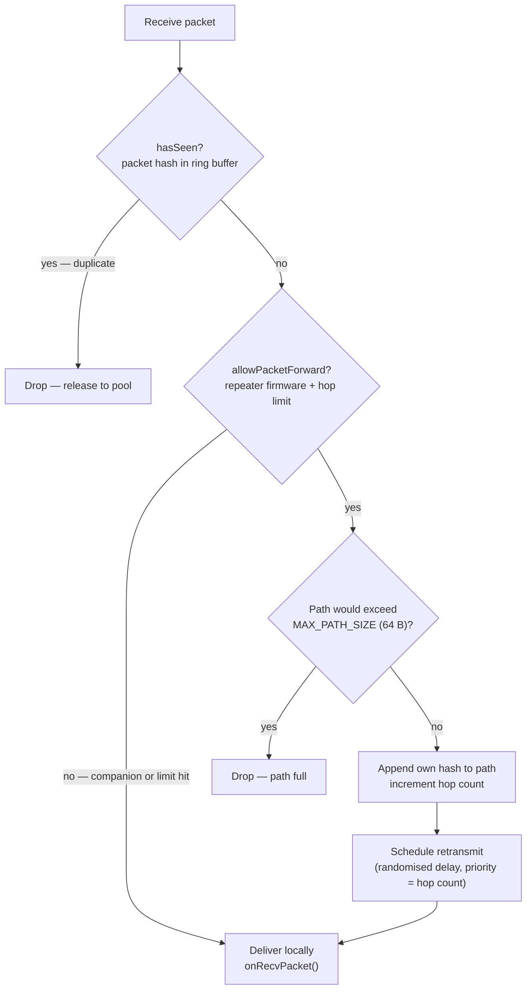

# Routing and Flooding

MeshCore uses two routing strategies — **flood** and **direct** — and
automatically upgrades from flood to direct as paths are discovered. This page
explains how each strategy works in the firmware, what drives the path
discovery process, and how path-hash sizing affects both collision resistance
and network reach.

---

## Two strategies, one switch

When a node sends its first message to a contact, it has no stored route. It
uses **flood routing**. After the message is delivered and the recipient sends
back a returned path, the sender switches to **direct routing** for all
subsequent messages to that contact.

| Strategy | Route-type value | Path field at send time | Who forwards |
|----------|-----------------|------------------------|--------------|
| Flood | `ROUTE_TYPE_FLOOD` | Empty | Every eligible repeater that hasn't seen the packet |
| Direct | `ROUTE_TYPE_DIRECT` | Explicit list of repeater hashes | Only the next listed repeater |

Group channel messages always use flood routing — there is no single recipient
to return a path, and the message is meant for everyone who knows the channel
secret.

---

## How a flood propagates



### Send side

The sender sets `ROUTE_TYPE_FLOOD` in the header and sends the packet with an
**empty path** (`path_length = 0x00`, no path bytes).

### Repeater side

Each repeater that receives the packet goes through this logic
(from `Mesh::routeRecvPacket()`):

1. **Has I already forwarded this?** — Each received packet's hash is computed
   and checked against a cyclic table (`SimpleMeshTables`, 160 entries). If the
   hash is already there, the packet is dropped. This prevents infinite loops.

2. **Am I allowed to forward?** — `allowPacketForward()` returns `true` for
   repeater firmware, `false` for companion-only devices. Companions receive
   floods but do not relay them.

3. **Is there still room in the path?** — The path field caps at 64 bytes
   (`MAX_PATH_SIZE`). If appending this node's hash would exceed 64 bytes, the
   packet is dropped.

4. **Append and retransmit.** — The repeater appends its own hash to the end
   of the path array, increments the hop count in `path_length`, and schedules
   a retransmit with a **randomised delay**.

### Randomised retransmit delay

To prevent simultaneous retransmissions (which would collide on the air), each
repeater delays its retransmit by a random multiple of half the estimated
airtime for that packet:

```cpp
// from Mesh::getRetransmitDelay()
uint32_t t = (radio.getEstAirtimeFor(packet->getRawLength()) * 52 / 50) / 2;
return rng.nextInt(0, 5) * t;  // 0 to 4× the half-airtime window
```

The slight airtime overestimate (52/50) and the random multiplier together
reduce collision probability even when many repeaters hear the same
transmission.

### Priority graduation

Packets closer to the source get higher retransmit priority. The priority
value passed to the scheduler equals the current hop count — a 1-hop relay
has priority 1, a 4-hop relay has priority 4. Lower numbers mean higher
priority, so nearer nodes retransmit first. This naturally shapes the wave
so that the flood expands in a consistent outward order.

---

## Path discovery: building the returned path

When the destination receives a flood packet, its path field contains the
ordered hashes of every repeater the packet touched:

```
path: [hash(R1)][hash(R2)][hash(R3)]
```

The destination's firmware constructs a `PAYLOAD_TYPE_PATH` packet containing
this path (ECDH-encrypted inside the payload) and sends it back to the
originator **directly**, using the flood path as the direct route in reverse.

From `Mesh.cpp`:

```cpp
if (onPeerPathRecv(pkt, j, secret, path, path_len, extra_type, extra, extra_len)) {
  if (pkt->isRouteFlood()) {
    // send the reciprocal path back directly
    mesh::Packet* rpath = createPathReturn(&src_hash, secret,
                                           pkt->path, pkt->path_len, 0, NULL, 0);
    if (rpath) sendDirect(rpath, path, path_len, 500);
  }
}
```

Once the originator receives the PATH packet and calls `onPeerPathRecv()`, it
stores the route and uses `sendDirect()` for all future messages.

!!! info "First-path wins"
    If a flood reaches the destination via multiple routes simultaneously,
    the first path to arrive and pass the MAC check is stored. The firmware
    does not compare route quality; speed-of-arrival determines which path
    becomes the direct route.

---

## Direct routing: using the stored path

The sender puts the stored repeater hash sequence into the packet's path field
and sets `ROUTE_TYPE_DIRECT`. As the packet traverses each hop, the logic in
`Mesh::onRecvPacket()` runs:

1. Check `isRouteDirect() && getPathHashCount() > 0`.
2. Check whether `path[0]` (the first hash) matches `self_id`. If not, this
   packet is not for this repeater — drop it (`ACTION_RELEASE`).
3. Call `removeSelfFromPath()`: shift the path array left by one hash entry and
   decrement the hop count. The next repeater is now at position 0.
4. Retransmit at highest priority (`0`).

When the hop count reaches zero, the packet has arrived at the destination.

---

## Path-hash sizing trade-offs

The hash stored in each path entry is a **prefix of the public key** — 1, 2,
or 3 bytes. Choosing the right size involves three competing concerns:

### 1. Collision probability

A 1-byte hash has 256 possible values. In a mesh with many repeaters it is
statistically possible for two repeaters to share the same first byte. A
**hash collision** in the path does not prevent delivery (the routing still
works — the wrong repeater simply ignores the packet since it is not listening
for that payload), but it corrupts diagnostic tools like trace routes and
network maps.

Larger hashes significantly reduce collision probability:

| Hash size | Distinct values | Probability of collision (10 repeaters) |
|-----------|-----------------|----------------------------------------|
| 1 byte    | 256             | ~18%                                   |
| 2 bytes   | 65,536          | ~0.08%                                 |
| 3 bytes   | 16,777,216      | negligible                             |

### 2. Path capacity (max hops)

The path field is fixed at 64 bytes. Larger hashes mean fewer repeater
entries fit:

| Hash size | Max hops |
|-----------|----------|
| 1 byte    | 64       |
| 2 bytes   | 32       |
| 3 bytes   | 21       |

### 3. Firmware compatibility

Multi-byte path hashes require firmware **≥ 1.14** on every repeater in the
path. Pre-1.14 firmware dropped packets with `path_bytes > 64`, which also
excluded the extra bytes a larger hash would add. Deploying 2- or 3-byte
hashes across a mesh that includes older firmware will silently drop packets
at the older node.

!!! tip "Rule of thumb"
    For most small-to-medium meshes (fewer than 30 repeaters), 1-byte hashes
    are sufficient. Switch to 2-byte hashes when you observe collision-related
    issues in traceroute output and you have confirmed all repeaters are on
    firmware ≥ 1.14.

---

## The seen-packet table

Duplicate suppression is critical for flood correctness. Without it, a 3-node
ring (A–B–C–A) would generate an infinite relay loop.

`SimpleMeshTables` maintains a cyclic array of 160 packet hashes
(`MAX_PACKET_HASHES = 128 + 32`). Each received packet's hash is computed with
`Packet::calculatePacketHash()` and checked against the table. A new packet
hash is written to the next slot, evicting the oldest when the table is full.

```cpp
// SimpleMeshTables::hasSeen() — simplified
uint8_t hash[MAX_HASH_SIZE];
packet->calculatePacketHash(hash);
for (int i = 0; i < MAX_PACKET_HASHES; i++) {
  if (memcmp(hash, &_hashes[i*MAX_HASH_SIZE], MAX_HASH_SIZE) == 0)
    return true;  // already seen
}
// new packet — record it
memcpy(&_hashes[_next_idx*MAX_HASH_SIZE], hash, MAX_HASH_SIZE);
_next_idx = (_next_idx + 1) % MAX_PACKET_HASHES;
return false;
```

At 160 entries, the table holds the last ~10–15 seconds of traffic at typical
flood rates. Packets that arrive after their entry has been evicted will be
relayed again — acceptable, since they would be too old to cause a loop by then.

---

## Why some packets always flood

**Advertisements** always use flood routing: the whole point of an advert is to
reach every node in the mesh, not just nodes with a stored path to this sender.

**Group channel messages** also always flood: no direct path exists to "the
group", and every member needs to receive the packet regardless of where they
are in the mesh.

**ACKs** and **returned paths** can be sent directly when the route is known.
If no path is known (e.g., the first ACK, or an ACK from a node that was
reached only via flood), they also travel as floods.

---

## What's next

- [Encryption on the Wire](encryption-on-the-wire.md) — what intermediate
  nodes can and cannot read in the packets they relay.
- [Adverts Deep Dive](adverts-deep-dive.md) — how the flood mechanism is used
  specifically for node discovery.
- [Packet Format spec](https://docs.meshcore.io/packet_format/) — path_length
  encoding, hash-size codes, and MAX_PATH_SIZE definition.
